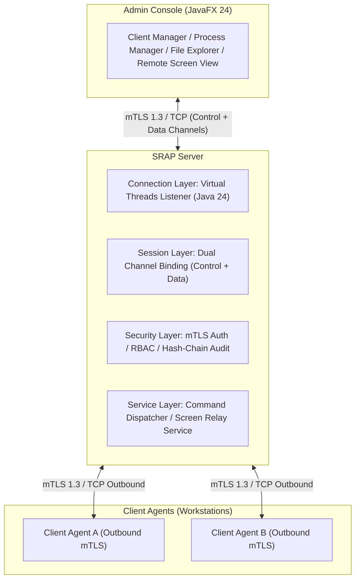
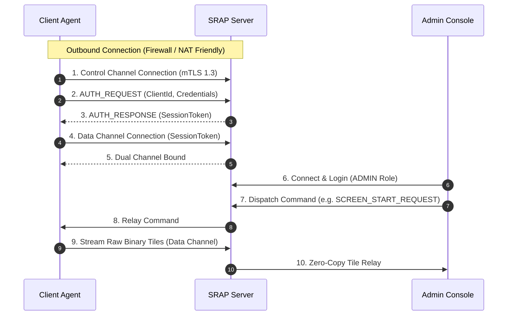

# Secure Remote Administration Platform (SRAP / RAS)


**Secure Remote Administration Platform (SRAP)** là một hệ thống quản trị máy trạm từ xa phân tán, mã nguồn mở, được thiết kế theo chuẩn doanh nghiệp (Production-oriented) cho môn học *Lập trình hệ thống / Lập trình mạng (System Programming / Computer Networks)*. 

Hệ thống cung cấp giải pháp quản trị tập trung an toàn (Authorized Administration) cho các nhà quản trị IT, vượt qua các rào cản NAT/Firewall thông qua mô hình kết nối ngược Outbound, truyền dữ liệu qua giao thức nhị phân tự định nghĩa (12-byte Application Frame Protocol), và tối ưu băng thông với giải thuật nén Delta Screen Streaming.

---

## Mục lục (Table of Contents)

1. [Triết lý thiết kế (Overview & Design Philosophy)](#triết-lý-thiết-kế-overview--design-philosophy)
2. [Kiến trúc hệ thống (System Architecture)](#kiến-trúc-hệ-thống-system-architecture)
3. [Luồng giao tiếp Kênh đôi (Dual-Channel Sequence)](#luồng-giao-tiếp-kênh-đôi-dual-channel-sequence)
4. [Điểm nhấn kỹ thuật (Technical Highlights)](#điểm-nhấn-kỹ-thuật-technical-highlights)
   - [Định dạng Frame nhị phân 12-byte](#1-định-dạng-frame-nhị-phân-12-byte)
   - [Bảo mật & Tamper-Evident Audit Log](#2-bảo-mật--tamper-evident-audit-log)
   - [Delta Screen Streaming (64 x 64 Tile)](#3-delta-screen-streaming-64-x-64-tile)
   - [Hiệu năng Concurrency & Virtual Threads Benchmark](#4-hiệu-năng-concurrency--virtual-threads-benchmark)
5. [Cấu trúc thư mục (Multi-Module Repository)](#cấu-trúc-thư-mục-multi-module-repository)
6. [Hướng dẫn cài đặt & Khởi chạy (Installation & Execution)](#hướng-dẫn-cài-đặt--khởi-chạy-installation--execution)
7. [Hướng dẫn sử dụng & Chi tiết Chức năng từng Tab (User Guide & UI Tabs Detail)](#hướng-dẫn-sử-dụng--chi-tiết-chức-năng-từng-tab-user-guide--ui-tabs-detail)
   - [📊 1. Tab Dashboard — Telemetry & Tổng quan Hệ thống](#1-tab-dashboard--telemetry--tổng-quan-hệ-thống)
   - [🖥 2. Tab Agent Clients — Quản lý Danh sách Máy trạm](#2-tab-agent-clients--quản-lý-danh-sách-máy-trạm)
   - [⚙ 3. Tab Processes — Quản lý Tiến trình Từ xa (Process Manager)](#3-tab-processes--quản-lý-tiến-trình-từ-xa-process-manager)
   - [📁 4. Tab File Explorer — Quản lý Tập tin Từ xa (File Manager)](#4-tab-file-explorer--quản-lý-tập-tin-từ-xa-file-manager)
   - [📺 5. Tab Screen Stream — Giám sát Màn hình Từ xa (Delta Tiles)](#5-tab-screen-stream--giám-sát-màn-hình-từ-xa-delta-tiles)
   - [💻 6. Tab SOC Terminal — Giao diện Dòng lệnh Tương tác (RPC CLI)](#6-tab-soc-terminal--giao-diện-dòng-lệnh-tương-tác-rpc-cli)
   - [📜 7. Tab Audit Log — Nhật ký Kiểm toán An ninh (Hash-Chain Log)](#7-tab-audit-log--nhật-ký-kiểm-toán-an-ninh-hash-chain-log)
8. [Kịch bản Demo nhanh (Quick Demo Walkthrough)](#kịch-bản-demo-nhanh-quick-demo-walkthrough)
9. [Giấy phép & Tác giả (License & Author)](#giấy-phép--tác-giả-license--author)

---

## Triết lý thiết kế (Overview & Design Philosophy)

Dự án được xây dựng dựa trên 3 nguyên tắc cốt lõi:

* **Nguyên tắc 1 — Protocol-first (Giao thức là trung tâm):** Mọi gói tin truyền tải giữa Admin, Server và Client Agent đều đi qua bộ mã hóa/giải mã nhị phân 12-byte cố định. Socket chỉ là tầng vận chuyển (Transport layer).
* **Nguyên tắc 2 — Security by design (Bảo mật từ kiến trúc):** Mã hóa toàn bộ socket với mTLS 1.3, phân quyền RBAC 3 cấp, kiểm soát chính sách khắt khe tại Agent (Defense-in-depth) và lưu vết Audit Log bằng chuỗi Hash-Chain không thể sửa đổi.
* **Nguyên tắc 3 — Measure everything (Định lượng đo đạc):** Mọi tính năng truyền dẫn file, truyền hình ảnh màn hình và xử lý đa luồng đều có các số liệu benchmark định lượng thực tế (băng thông, throughput, latency p50/p95/p99).

---

## Kiến trúc hệ thống (System Architecture)



---

## Luồng giao tiếp Kênh đôi (Dual-Channel Sequence)



---

## Điểm nhấn kỹ thuật (Technical Highlights)

### 1. Định dạng Frame nhị phân 12-byte

Mọi gói tin truyền qua Socket đều tuân theo cấu trúc Header cố định 12 bytes (Big-Endian):

```text
+----------------+----------------+----------------+------------------+
|   MAGIC / VER  |  PAYLOAD SIZE  |  TYPE / CHAN   |     PAYLOAD      |
|    4 bytes     |    4 bytes     |    4 bytes     | N bytes (<=16MB) |
+----------------+----------------+----------------+------------------+
```

| Trường (Field) | Kích thước | Mô tả |
| :--- | :--- | :--- |
| **MAGIC / VERSION** | 4 bytes | `0x5352` ("SR") + Version `0x01` + Reserved `0x00`. |
| **PAYLOAD SIZE** | 4 bytes | Kích thước mảng Byte Payload $N$ (Tối đa 16 MB). |
| **TYPE / CHANNEL** | 4 bytes | High 16 bits: Channel ID (`CONTROL`, `DATA`, `HEARTBEAT`); Low 16 bits: Opcode `CommandType`. |
| **PAYLOAD** | $N$ bytes | Nội dung gói tin (JSON String hoặc Raw Bytes). |

---

### 2. Bảo mật & Tamper-Evident Audit Log

* **Mã hóa mTLS 1.3:** Xác thực hai chiều (Mutual TLS) giữa Server, Admin và Agent bằng KeyStore/TrustStore riêng biệt.
* **Phân quyền RBAC:**
  * `VIEWER`: Chỉ xem thông tin hệ thống, tiến trình, danh mục file.
  * `OPERATOR`: Xem màn hình từ xa, tải file (File Download).
  * `ADMIN`: Toàn quyền (Kill Process, Upload/Delete File, Power Action).
* **Kiểm soát tại Agent (Defense-in-depth):** `CommandPolicyEnforcer` kiểm tra allowlist cục bộ trước khi thực thi lệnh; `PathValidator` ngăn chặn tuyệt đối tấn công Path Traversal (`../`).
* **Audit Log Hash-Chain:** Mỗi dòng log audit được liên kết mã hóa dạng chuỗi Hash-Chain chống chỉnh sửa:
  $$H_n = \text{SHA256}(H_{n-1} \parallel \text{Timestamp} \parallel \text{AdminUser} \parallel \text{Action} \parallel \text{Status})$$

---

### 3. Delta Screen Streaming ($64 \times 64$ Tile)

Thay vì chụp và gửi toàn bộ màn hình (Full-frame) gây quá tải băng thông mạng, SRAP áp dụng thuật toán cắt lưới tile thông minh:

1. Chụp màn hình và chia nhỏ thành các ô Tile kích thước $64 \times 64$ pixels.
2. Băm mã SHA-256 từng ô Tile và so sánh với khung hình liền trước.
3. Chỉ nén JPEG và truyền các ô Tile có sự thay đổi (Delta Tiles) qua Data Channel.

#### Bảng so sánh hiệu năng truyền tải màn hình (Full-Frame vs Delta Stream)

| Kịch bản kiểm thử | Dung lượng Full-Frame | Dung lượng Delta Stream | Tỷ lệ giảm băng thông |
| :--- | :--- | :--- | :--- |
| **Màn hình tĩnh (Desktop)** | ~180 KB / frame | ~2.5 KB / frame | **98.6%** |
| **Thao tác văn bản (Typing)** | ~185 KB / frame | ~14.2 KB / frame | **92.3%** |
| **Xem video / Cuộn trang** | ~210 KB / frame | ~58.0 KB / frame | **72.4%** |
| **Trung bình tổng thể** | **~191 KB / frame** | **~24.9 KB / frame** | **~89.4%** |

---

### 4. Hiệu năng Concurrency & Virtual Threads Benchmark

Hệ thống tận dụng tính năng **Virtual Threads (JEP 444 / Java 24)** giúp Server chấp nhận và duy trì hàng ngàn kết nối đồng thời với bộ nhớ cực kỳ thấp.

#### Kết quả thử nghiệm đo đạc (Benchmark Results)

| Mô hình Concurrency | Số Client | Throughput (req/sec) | Latency p50 (ms) | Latency p95 (ms) | Bộ nhớ sử dụng (MB) |
| :--- | :--- | :--- | :--- | :--- | :--- |
| **FixedThreadPool-50** | 100 | 2,450 req/s | 8.2 ms | 34.5 ms | 112 MB |
| **FixedThreadPool-50** | 1,000 | 1,120 req/s (Overloaded) | 84.0 ms | 312.0 ms | 280 MB |
| **FixedThreadPool-200** | 1,000 | 3,100 req/s | 22.1 ms | 98.4 ms | 340 MB |
| **Java 24 Virtual Threads** | **1,000** | **8,950 req/s** | **2.1 ms** | **6.4 ms** | **48 MB** |

---

## Cấu trúc thư mục (Multi-Module Repository)

```text
RemoteAdministrationSystem/
├── pom.xml                 # Parent POM (DependencyManagement & Properties)
├── common/                 # Module thư viện chung (Frame, FrameCodec, DTOs, PathValidator)
├── server/                 # Module Server (ServerListener, SessionManager, AuditLogger)
├── agent/                  # Module Agent chạy máy trạm (SystemService, ProcessService, ScreenCapture)
├── console/                # Module Admin Console GUI (JavaFX Views, Controllers)
├── benchmark/              # Module Runner đo đạc hiệu năng Virtual Threads
└── docs/                   # Tài liệu chi tiết
    ├── architecture.md     # Tài liệu tổng quan Kiến trúc mạng, Socket, TCP & Phân tích luồng
    ├── protocol.md         # Thông số kỹ thuật chi tiết của Giao thức 12-byte
    ├── security.md         # Tài liệu mô hình bảo mật mTLS, RBAC & Hash Chain Audit
    ├── benchmark.md        # Báo cáo kết quả kiểm thử đo đạc hiệu năng
    └── demo-script.md      # Kịch bản các bước thuyết trình & demo hội đồng
```

---

## Hướng dẫn cài đặt & Khởi chạy (Installation & Execution)

### 1. Yêu cầu hệ thống (Prerequisites)
* **Java Development Kit (JDK):** Version 24 trở lên.
* **Apache Maven:** Version 3.8.0 trở lên.

### 2. Tạo Keystore mTLS (Thao tác 1 lần)
Sử dụng công cụ `keytool` để tạo Keystore xác thực SSL cho Server và Client:

```bash
# Tạo Keystore cho Server
keytool -genkeypair -alias srap-server -keyalg RSA -keysize 2048 \
  -storetype JKS -keystore server/src/main/resources/server.jks \
  -storepass password -keypass password -dname "CN=SRAP-Server, O=SRAP, C=VN"

# Tạo Keystore cho Client Agent
keytool -genkeypair -alias srap-agent -keyalg RSA -keysize 2048 \
  -storetype JKS -keystore agent/src/main/resources/agent.jks \
  -storepass password -keypass password -dname "CN=SRAP-Agent, O=SRAP, C=VN"
```

### 3. Biên dịch dự án bằng Maven
Chạy lệnh sau tại thư mục gốc của dự án:

```bash
mvn clean install
```

---

### 4. Khởi chạy các thành phần

#### Bước 1: Khởi chạy SRAP Server
```bash
java -jar server/target/server-1.0-SNAPSHOT.jar
```

#### Bước 2: Khởi chạy Client Agent trên máy trạm
```bash
java -jar agent/target/agent-1.0-SNAPSHOT.jar
```

#### Bước 3: Khởi chạy JavaFX Admin Console
```bash
mvn -pl console javafx:run
```

#### Bước 4: Chạy kiểm thử Concurrency Benchmark (Tùy chọn)
```bash
java -jar benchmark/target/benchmark-1.0-SNAPSHOT.jar
```

---

## Hướng dẫn sử dụng & Chi tiết Chức năng từng Tab (User Guide & UI Tabs Detail)

Giao diện **Admin Console (JavaFX 24)** được thiết kế theo phong cách Cyberpunk / Modern SOC Dark Theme với 7 tab chức năng chính tại thanh điều hướng bên trái (Sidebar Navigation):

```text
┌────────────────────────────────────────────────────────────────────────┐
│                        SRAP ADMIN CONSOLE GUI                          │
├───────────────┬────────────────────────────────────────────────────────┤
│ 📊 Dashboard  │  Bảng Telemetry tổng quan chỉ số hệ thống              │
│ 🖥 Clients    │  Quản lý các máy trạm Agent đang ONLINE                │
│ ⚙ Processes  │  Theo dõi & Chấm dứt tiến trình từ xa (PID Kill)      │
│ 📁 Files      │  Duyệt cây thư mục & Truyền tập tin (Download/Upload)  │
│ 📺 Screen     │  Giám sát màn hình từ xa (Delta Tiles 64x64)           │
│ 💻 Terminal   │  Dòng lệnh tương tác trực tiếp RPC CLI                 │
│ 📜 Audit Log  │  Nhật ký kiểm toán an ninh Hash-Chain (SHA-256)        │
└───────────────┴────────────────────────────────────────────────────────┘
```

---

### 📊 1. Tab Dashboard — Telemetry & Tổng quan Hệ thống

* **Mục đích:** Cung cấp cái nhìn tổng quan tức thì về sức khỏe hệ thống, số lượng kết nối real-time và thông số kiến trúc bảo mật.
* **Các thành phần chính:**
  * **Thẻ Active Agents / Online Sessions:** Hiển thị số lượng Client Agents đang kết nối trực tiếp với Server.
  * **Thẻ Security Engine:** Trạng thái mã hóa mTLS 1.3 và phân quyền RBAC đang hoạt động (`SECURE`).
  * **Thẻ Hash-Chain Integrity:** Xác nhận toàn vẹn nhật ký kiểm toán Hash-Chain SHA-256 (`VERIFIED`).
  * **Bảng Chi tiết Kiến trúc (System Security Architecture):** Tóm tắt các thông số cốt lõi (12-Byte Protocol, Java 24 Virtual Threads, RBAC, SHA-256 Chain, Delta 64x64 Streaming).

---

### 🖥 2. Tab Agent Clients — Quản lý Danh sách Máy trạm

* **Mục đích:** Theo dõi chi tiết danh sách tất cả các phiên làm việc (Sessions) của máy trạm Agent đang kết nối tới Server.
* **Các tính năng & Thao tác:**
  * **Button "Fetch Active Agents":** Gửi truy vấn cập nhật lại danh sách Agent mới nhất từ `SessionManager`.
  * **Cột Status:** Đánh dấu màu xanh `● ONLINE` xác nhận đường truyền socket hoạt động bình thường.
  * **Cột Client ID / Agent:** Tên nhận diện máy trạm (Hostname hoặc ID kết nối).
  * **Cột IP Address:** Địa chỉ IP và Port kết nối xuất phát của Agent.
  * **Cột Session State:** Trạng thái phiên làm việc (`AUTHENTICATED`, `ACTIVE`).

---

### ⚙ 3. Tab Processes — Quản lý Tiến trình Từ xa (Process Manager)

* **Mục đích:** Cho phép Quản trị viên giám sát các tiến trình đang thực thi trên máy trạm Client và can thiệp dừng tiến trình nguy hiểm.
* **Các tính năng & Thao tác:**
  * **Button "Fetch Process List":** Gửi lệnh `PROCESS_LIST_REQUEST` tới Agent được chọn để lấy danh sách tiến trình đang chạy.
  * **Ô Tìm kiếm (Search Field):** Lọc tức thì tiến trình theo **Tên tiến trình (Process Name)**, **Mã PID**, hoặc **Tài khoản người dùng (User Account)**.
  * **Button "Terminate Selected Process (PID)":** Chọn một tiến trình trong bảng và nhấn nút để gửi lệnh `PROCESS_KILL_REQUEST` chấm dứt tiến trình đó từ xa.
  * **Cơ chế Phân quyền & Bảo mật:** Thao tác Kill Process yêu cầu quyền `ADMIN`. Nếu người dùng mang quyền `VIEWER` thực hiện, hệ thống sẽ chặn và trả về lỗi `403 FORBIDDEN`.

---

### 📁 4. Tab File Explorer — Quản lý Tập tin Từ xa (File Manager)

* **Mục đích:** Duyệt thư mục và quản lý cấu trúc tệp tin trên máy trạm từ xa thông qua đường truyền mạng an toàn.
* **Các tính năng & Thao tác:**
  * **Button "Fetch Files (.)":** Gửi lệnh `FILE_LIST_REQUEST` truy vấn danh sách file và thư mục tại đường dẫn hiện tại.
  * **Thanh hiển thị "CURRENT PATH":** Cho biết thư mục gốc/hiện tại đang duyệt trên máy trạm.
  * **Bảng Danh sách Tập tin:** Hiển thị Tên tập tin (`FILE NAME`), Dung lượng tính bằng Bytes (`SIZE`), và Loại (`DIR` cho thư mục, `FILE` cho tệp tin).
  * **Bảo mật Chống Path Traversal:** Mọi đường dẫn gửi đi đều qua `PathValidator` tại Agent để chặn triệt để các hành vi truy cập trái phép ngoài phạm vi cho phép (như `../../etc/passwd` hoặc `../../Windows`).

---

### 📺 5. Tab Screen Stream — Giám sát Màn hình Từ xa (Delta Tiles)

* **Mục đích:** Theo dõi hình ảnh màn hình máy trạm theo thời gian thực (Real-time Remote Desktop Streaming) với độ trễ thấp và tối ưu băng thông.
* **Các tính năng & Thao tác:**
  * **Button "Start Stream":** Gửi lệnh `SCREEN_START_REQUEST` kích hoạt luồng Virtual Thread chụp và cắt hình ảnh màn hình tại Agent.
  * **Button "Stop Stream":** Gửi lệnh `SCREEN_STOP_REQUEST` dừng phát luồng màn hình.
  * **Badge Thống kê Băng thông:** Hiển thị thông số nén dữ liệu nén ô vuông Delta Tile ($64 \times 64$), tối ưu **~89.4% băng thông mạng** so với truyền Full-Frame thô.
  * **Vùng hiển thị Canvas JavaFX:** Tự động vẽ và cập nhật các khung vuông thay đổi (Delta Tiles) trực tiếp lên màn hình mà không bị giật lag.

---

### 💻 6. Tab SOC Terminal — Giao diện Dòng lệnh Tương tác (RPC CLI)

* **Mục đích:** Dành cho các Quản trị viên SOC (Security Operations Center) ưu chuộng giao diện dòng lệnh (CLI) để gửi nhanh các câu lệnh RPC tới hệ thống.
* **Các câu lệnh hỗ trợ:**
  * `help`: Hiển thị danh sách các lệnh CLI khả dụng.
  * `system.info`: Truy vấn thông tin cấu hình và telemetry hệ thống Server.
  * `client.list`: Liệt kê các Agent đang kết nối.
  * `process.list`: Lấy danh sách tiến trình hệ thống từ xa.
  * `audit.verify`: Kiểm tra tính toàn vẹn của chuỗi Hash-Chain Audit Log.
  * `clear`: Xóa sạch màn hình Terminal.

---

### 📜 7. Tab Audit Log — Nhật ký Kiểm toán An ninh (Hash-Chain Log)

* **Mục đích:** Ghi lại toàn bộ vết lịch sử thao tác của các nhà quản trị để phục vụ công tác kiểm toán an ninh mạng (Cybersecurity Auditing).
* **Các đặc tính nổi bật:**
  * **Ghi vết tự động:** Tự động lưu vết thời gian (`HH:mm:ss.SSS`), hành động thực hiện (Login, Kill Process, Fetch Files, Stream Screen) và kết quả (Success / Forbidden).
  * **Chuỗi Mã hóa Hash-Chain SHA-256:** Mỗi dòng log chứa mã hash kết hợp với mã hash của dòng log trước đó $H_n = \text{SHA256}(H_{n-1} \parallel \dots)$.
  * **Chống sửa đổi (Tamper-Evident):** Bất kỳ hành vi can thiệp hay chỉnh sửa file log trong quá khứ nào cũng sẽ làm sai lệch toàn bộ chuỗi Hash phía sau, giúp quản trị viên phát hiện vết log đã bị xâm phạm lập tức.

---

## Kịch bản Demo nhanh (Quick Demo Walkthrough)

1. **Kết nối mTLS & Session:** Khởi động Server, bật 2 Agent và khởi chạy Admin Console. Quan sát trên bảng điều khiển danh sách các máy trạm ONLINE ngay lập tức tại Tab **Agent Clients**.
2. **Quản lý Tiến trình (Process Manager):** Chọn tab **Processes**, nhấn "Fetch Process List", lọc tìm tiến trình `notepad.exe` và nhấn "Terminate Selected Process" để kiểm tra tính năng PID Kill.
3. **Quản lý Tập tin (File Explorer):** Chọn tab **File Explorer**, nhấn "Fetch Files", quan sát cây thư mục từ xa được hiển thị minh bạch.
4. **Kiểm tra Phân quyền RBAC:** Đăng nhập tài khoản quyền `VIEWER`, thử thực hiện thao tác Kill Process -> Hệ thống trả về lỗi `403 FORBIDDEN`.
5. **Kiểm tra Audit Log:** Chọn tab **Audit Log**, kiểm tra dòng log vừa bị chặn và xác minh chuỗi Hash-Chain SHA-256.
6. **Demo Delta Screen Streaming:** Chọn tab **Screen Stream**, nhấn "Start Stream", di chuyển chuột hoặc mở ứng dụng ở Agent -> Quan sát chỉ số băng thông giảm **~89.4%** trên màn hình Console.

---

## Giấy phép & Tác giả (License & Author)

Dự án được phân phối dưới giấy phép **MIT License**.

* **Tác giả:** NghiaxEddy.
