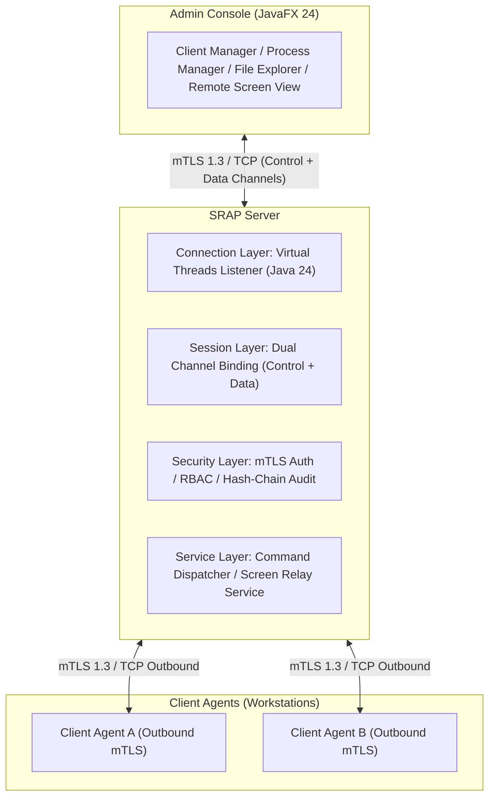
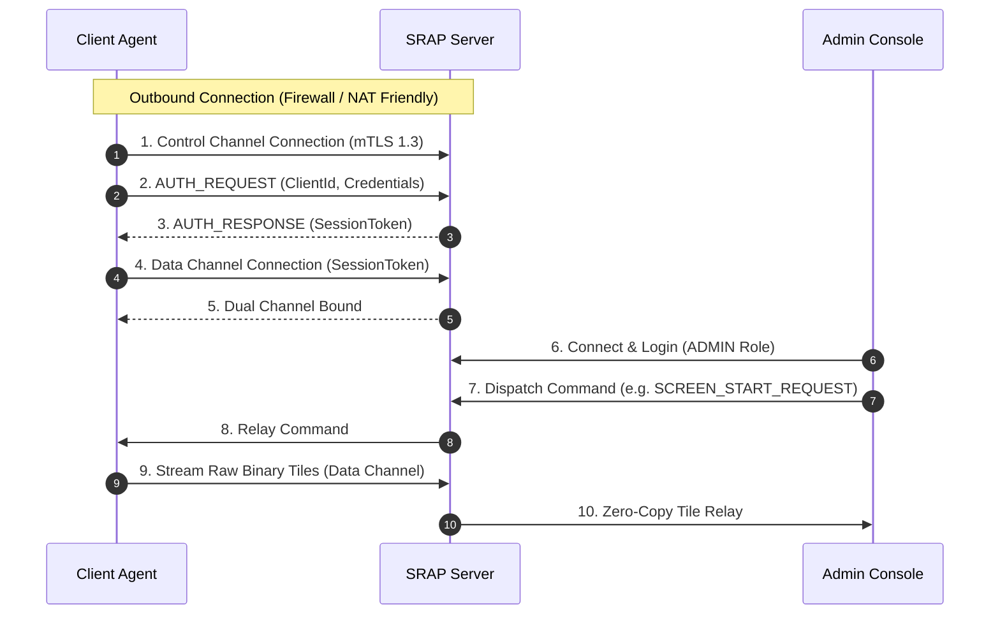

# Secure Remote Administration Platform (SRAP / RAS)


**Secure Remote Administration Platform (SRAP)** là một hệ thống quản trị máy trạm từ xa phân tán, mã nguồn mở, được thiết kế theo chuẩn doanh nghiệp (Production-oriented) cho môn học *Lập trình hệ thống / Lập trình mạng (System Programming / Computer Networks)*. 

Hệ thống cung cấp giải pháp quản trị tập trung an toàn (Authorized Administration) cho các nhà quản trị IT, vượt qua các rào cản NAT/Firewall thông qua mô hình kết nối ngược Outbound, truyền dữ liệu qua giao thức nhị phân tự định nghĩa (12-byte Application Frame Protocol), và tối ưu băng thông với giải thuật nén Delta Screen Streaming.

---

## Mục lục (Table of Contents)

1. [Triết lý thiết kế (Overview & Design Philosophy)](#triết-lý-thiết-kế-overview--design-philosophy)
2. [Kiến trúc hệ thống (System Architecture)](#kiến-trúc-hệ-thống-system-architecture)
3. [Luồng giao tiếp Kênh đôi (Dual-Channel Sequence)](#luồng-giao-tiếp-kênh-đôi-dual-channel-sequence)
4. [Điểm nhấn kỹ thuật (Technical Highlights)](#điểm-nhấn-kỹ-thuật-technical-highlights)
   - [Định dạng Frame nhị phân 12-byte](#1-định-dạng-frame-nhị-phân-12-byte)
   - [Bảo mật & Tamper-Evident Audit Log](#2-bảo-mật--tamper-evident-audit-log)
   - [Delta Screen Streaming (64 x 64 Tile)](#3-delta-screen-streaming-64-x-64-tile)
   - [Hiệu năng Concurrency & Virtual Threads Benchmark](#4-hiệu-năng-concurrency--virtual-threads-benchmark)
5. [Cấu trúc thư mục (Multi-Module Repository)](#cấu-trúc-thư-mục-multi-module-repository)
6. [Hướng dẫn cài đặt & Khởi chạy (Installation & Execution)](#hướng-dẫn-cài-đặt--khởi-chạy-installation--execution)
7. [Kịch bản Demo nhanh (Quick Demo Walkthrough)](#kịch-bản-demo-nhanh-quick-demo-walkthrough)
8. [Giấy phép & Tác giả (License & Author)](#giấy-phép--tác-giả-license--author)

---

## Triết lý thiết kế (Overview & Design Philosophy)

Dự án được xây dựng dựa trên 3 nguyên tắc cốt lõi:

* **Nguyên tắc 1 — Protocol-first (Giao thức là trung tâm):** Mọi gói tin truyền tải giữa Admin, Server và Client Agent đều đi qua bộ mã hóa/giải mã nhị phân 12-byte cố định. Socket chỉ là tầng vận chuyển (Transport layer).
* **Nguyên tắc 2 — Security by design (Bảo mật từ kiến trúc):** Mã hóa toàn bộ socket với mTLS 1.3, phân quyền RBAC 3 cấp, kiểm soát chính sách khắt khe tại Agent (Defense-in-depth) và lưu vết Audit Log bằng chuỗi Hash-Chain không thể sửa đổi.
* **Nguyên tắc 3 — Measure everything (Định lượng đo đạc):** Mọi tính năng truyền dẫn file, truyền hình ảnh màn hình và xử lý đa luồng đều có các số liệu benchmark định lượng thực tế (băng thông, throughput, latency p50/p95/p99).

---

## Kiến trúc hệ thống (System Architecture)



---

## Luồng giao tiếp Kênh đôi (Dual-Channel Sequence)



---

## Điểm nhấn kỹ thuật (Technical Highlights)

### 1. Định dạng Frame nhị phân 12-byte

Mọi gói tin truyền qua Socket đều tuân theo cấu trúc Header cố định 12 bytes (Big-Endian):

```text
+----------------+----------------+----------------+------------------+
|   MAGIC / VER  |  PAYLOAD SIZE  |  TYPE / CHAN   |     PAYLOAD      |
|    4 bytes     |    4 bytes     |    4 bytes     | N bytes (<=16MB) |
+----------------+----------------+----------------+------------------+
```

| Trường (Field) | Kích thước | Mô tả |
| :--- | :--- | :--- |
| **MAGIC / VERSION** | 4 bytes | `0x5352` ("SR") + Version `0x01` + Reserved `0x00`. |
| **PAYLOAD SIZE** | 4 bytes | Kích thước mảng Byte Payload $N$ (Tối đa 16 MB). |
| **TYPE / CHANNEL** | 4 bytes | High 16 bits: Channel ID (`CONTROL`, `DATA`, `HEARTBEAT`); Low 16 bits: Opcode `CommandType`. |
| **PAYLOAD** | $N$ bytes | Nội dung gói tin (JSON String hoặc Raw Bytes). |

---

### 2. Bảo mật & Tamper-Evident Audit Log

* **Mã hóa mTLS 1.3:** Xác thực hai chiều (Mutual TLS) giữa Server, Admin và Agent bằng KeyStore/TrustStore riêng biệt.
* **Phân quyền RBAC:**
  * `VIEWER`: Chỉ xem thông tin hệ thống, tiến trình, danh mục file.
  * `OPERATOR`: Xem màn hình từ xa, tải file (File Download).
  * `ADMIN`: Toàn quyền (Kill Process, Upload/Delete File, Power Action).
* **Kiểm soát tại Agent (Defense-in-depth):** `CommandPolicyEnforcer` kiểm tra allowlist cục bộ trước khi thực thi lệnh; `PathValidator` ngăn chặn tuyệt đối tấn công Path Traversal (`../`).
* **Audit Log Hash-Chain:** Mỗi dòng log audit được liên kết mã hóa dạng chuỗi Hash-Chain chống chỉnh sửa:
  $$H_n = \text{SHA256}(H_{n-1} \parallel \text{Timestamp} \parallel \text{AdminUser} \parallel \text{Action} \parallel \text{Status})$$

---

### 3. Delta Screen Streaming ($64 \times 64$ Tile)

Thay vì chụp và gửi toàn bộ màn hình (Full-frame) gây quá tải băng thông mạng, SRAP áp dụng thuật toán cắt lưới tile thông minh:

1. Chụp màn hình và chia nhỏ thành các ô Tile kích thước $64 \times 64$ pixels.
2. Băm mã SHA-256 từng ô Tile và so sánh với khung hình liền trước.
3. Chỉ nén JPEG và truyền các ô Tile có sự thay đổi (Delta Tiles) qua Data Channel.

#### Bảng so sánh hiệu năng truyền tải màn hình (Full-Frame vs Delta Stream)

| Kịch bản kiểm thử | Dung lượng Full-Frame | Dung lượng Delta Stream | Tỷ lệ giảm băng thông |
| :--- | :--- | :--- | :--- |
| **Màn hình tĩnh (Desktop)** | ~180 KB / frame | ~2.5 KB / frame | **98.6%** |
| **Thao tác văn bản (Typing)** | ~185 KB / frame | ~14.2 KB / frame | **92.3%** |
| **Xem video / Cuộn trang** | ~210 KB / frame | ~58.0 KB / frame | **72.4%** |
| **Trung bình tổng thể** | **~191 KB / frame** | **~24.9 KB / frame** | **~89.4%** |

---

### 4. Hiệu năng Concurrency & Virtual Threads Benchmark

Hệ thống tận dụng tính năng **Virtual Threads (JEP 444 / Java 24)** giúp Server chấp nhận và duy trì hàng ngàn kết nối đồng thời với bộ nhớ cực kỳ thấp.

#### Kết quả thử nghiệm đo đạc (Benchmark Results)

| Mô hình Concurrency | Số Client | Throughput (req/sec) | Latency p50 (ms) | Latency p95 (ms) | Bộ nhớ sử dụng (MB) |
| :--- | :--- | :--- | :--- | :--- | :--- |
| **FixedThreadPool-50** | 100 | 2,450 req/s | 8.2 ms | 34.5 ms | 112 MB |
| **FixedThreadPool-50** | 1,000 | 1,120 req/s (Overloaded) | 84.0 ms | 312.0 ms | 280 MB |
| **FixedThreadPool-200** | 1,000 | 3,100 req/s | 22.1 ms | 98.4 ms | 340 MB |
| **Java 24 Virtual Threads** | **1,000** | **8,950 req/s** | **2.1 ms** | **6.4 ms** | **48 MB** |

---

## Cấu trúc thư mục (Multi-Module Repository)

```text
RemoteAdministrationSystem/
├── pom.xml                 # Parent POM (DependencyManagement & Properties)
├── common/                 # Module thư viện chung (Frame, FrameCodec, DTOs, PathValidator)
├── server/                 # Module Server (ServerListener, SessionManager, AuditLogger)
├── agent/                  # Module Agent chạy máy trạm (SystemService, ProcessService, ScreenCapture)
├── console/                # Module Admin Console GUI (JavaFX Views, Controllers)
├── benchmark/              # Module Runner đo đạc hiệu năng Virtual Threads
└── docs/                   # Tài liệu chi tiết
    ├── protocol.md         # Thông số kỹ thuật chi tiết của Giao thức 12-byte
    ├── security.md         # Tài liệu mô hình bảo mật mTLS, RBAC & Hash Chain Audit
    ├── benchmark.md        # Báo cáo kết quả kiểm thử đo đạc hiệu năng
    └── demo-script.md      # Kịch bản các bước thuyết trình & demo hội đồng
```

---

## Hướng dẫn cài đặt & Khởi chạy (Installation & Execution)

### 1. Yêu cầu hệ thống (Prerequisites)
* **Java Development Kit (JDK):** Version 24 trở lên.
* **Apache Maven:** Version 3.8.0 trở lên.

### 2. Tạo Keystore mTLS (Thao tác 1 lần)
Sử dụng công cụ `keytool` để tạo Keystore xác thực SSL cho Server và Client:

```bash
# Tạo Keystore cho Server
keytool -genkeypair -alias srap-server -keyalg RSA -keysize 2048 \
  -storetype JKS -keystore server/src/main/resources/server.jks \
  -storepass password -keypass password -dname "CN=SRAP-Server, O=SRAP, C=VN"

# Tạo Keystore cho Client Agent
keytool -genkeypair -alias srap-agent -keyalg RSA -keysize 2048 \
  -storetype JKS -keystore agent/src/main/resources/agent.jks \
  -storepass password -keypass password -dname "CN=SRAP-Agent, O=SRAP, C=VN"
```

### 3. Biên dịch dự án bằng Maven
Chạy lệnh sau tại thư mục gốc của dự án:

```bash
mvn clean install
```

---

### 4. Khởi chạy các thành phần

#### Bước 1: Khởi chạy SRAP Server
```bash
java -jar server/target/server-1.0-SNAPSHOT.jar
```

#### Bước 2: Khởi chạy Client Agent trên máy trạm
```bash
java -jar agent/target/agent-1.0-SNAPSHOT.jar
```

#### Bước 3: Khởi chạy JavaFX Admin Console
```bash
mvn -pl console javafx:run
```

#### Bước 4: Chạy kiểm thử Concurrency Benchmark
```bash
java -jar benchmark/target/benchmark-1.0-SNAPSHOT.jar
```

---

## Kịch bản Demo nhanh (Quick Demo Walkthrough)

1. **Kết nối mTLS & Session:** Khởi động Server, bật 2 Agent và khởi chạy Admin Console. Quan sát trên bảng điều khiển danh sách các máy trạm ONLINE ngay lập tức.
2. **Quản lý Tiến trình (Process Manager):** Chọn máy `PC-01`, xem danh sách tiến trình đang chạy, thực hiện chấm dứt tiến trình `notepad.exe` (PID Kill).
3. **Quản lý Tập tin (File Explorer):** Duyệt cây thư mục từ xa, thực hiện Tải file (Download) và Tải file lên (Upload), kiểm tra toàn vẹn bằng mã hash SHA-256.
4. **Kiểm tra Phân quyền RBAC:** Đăng nhập tài khoản quyền `VIEWER`, thử thực hiện thao tác Kill Process -> Hệ thống trả về lỗi `403 FORBIDDEN`.
5. **Kiểm tra Audit Log:** Mở tab Audit Log, kiểm tra dòng log vừa bị chặn và xác minh chuỗi Hash-Chain.
6. **Demo Delta Screen Streaming:** Bật chế độ xem màn hình từ xa, di chuyển chuột hoặc gõ bản tin -> Quan sát chỉ số băng thông giảm **~89.4%** trên màn hình.

---

## Giấy phép & Tác giả (License & Author)

Dự án được phân phối dưới giấy phép **MIT License**.

* **Tác giả:** Đội ngũ phát triển đồ án Lập trình mạng / System Programming.
* **Tài liệu tham khảo:** [docs/protocol.md](docs/protocol.md) | [docs/security.md](docs/security.md) | [docs/benchmark.md](docs/benchmark.md)
